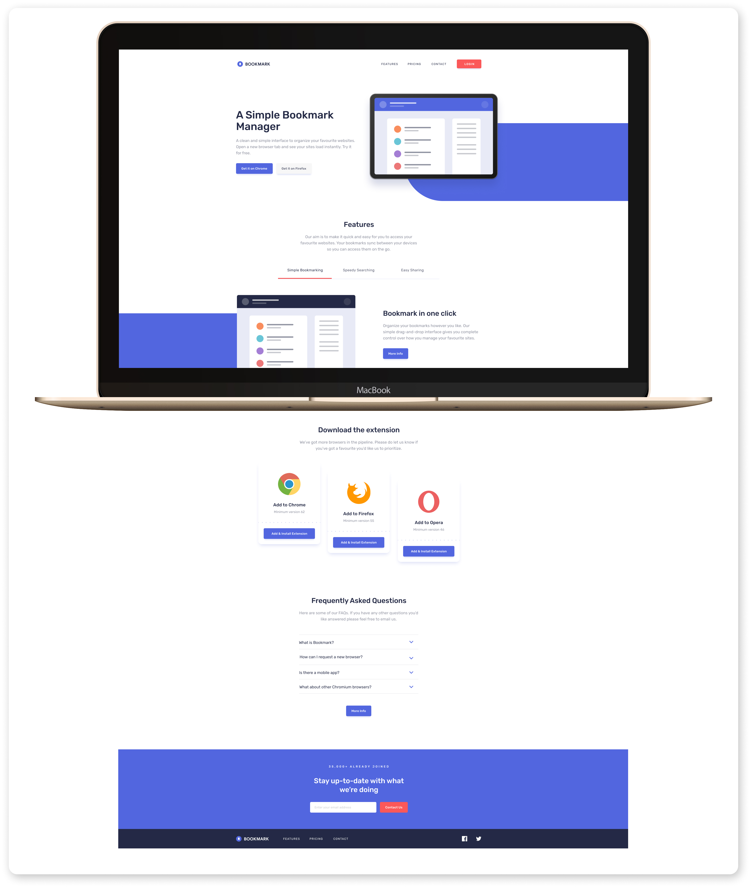

# Bookmark Landing Page

This project is a **Bookmark Landing Page**, built as a part of a challenge from [Frontend Mentor](https://www.frontendmentor.io/). It is a React-based web application developed using TypeScript, Vite, Tailwind CSS, and other modern web development tools. The project structure follows best practices for maintainability and scalability, with modular components, custom hooks, and reusable layouts.

## Demo

Check out the live demo 👉 <a href="https://bookmark-react-ts.vercel.app" target="_blank">here</a>.




## Features

- **Hero Section**: Introductory section with a headline, subheadline, and call-to-action button designed to capture attention and provide an overview of the Bookmark app.
- **Features Section**: Highlights the app’s key features using tab navigation. Each tab displays a title, description, and image, helping users understand the app's functionality.
- **Download Section**: Provides download links for various platforms, allowing users to easily install the Bookmark app on their preferred device.
- **FAQ Section**: A list of frequently asked questions with answers to help users quickly find solutions to common inquiries.
- **Navbar**: A responsive navigation bar with links to sections of the landing page, including the logo and social media icons.
- **Footer**: Located at the bottom of the page, it includes navigation links, social icons, and the Bookmark logo, offering easy access to important resources.
- **Custom Hooks**: Implements reusable hooks like `useToggleMenu` to manage the mobile menu's state, improving code organization.
- **Reusable Components**: Components like `Button`, `Card`, `Tabs`, and `BlockWithImage` are designed for flexibility and reuse across the landing page.
- **TypeScript Support**: Provides static type checking, enhancing code quality and reducing runtime errors.
- **Tailwind CSS**: Utilizes Tailwind CSS for styling, leveraging utility-first classes for rapid UI development.
- **Vite**: Built using Vite for a faster development experience and optimized production builds.
- **PostCSS & Autoprefixer**: Automates CSS transformations and adds vendor prefixes for cross-browser compatibility.
- **Responsive Design**: Ensures a seamless experience across devices, adapting the layout and components to different screen sizes.


## Installation

To run this project locally, follow these steps:

1. **Clone the repository**:
    ```bash
    git clone https://github.com/your-username/bookmark-landing-page.git
    ```

2. **Install dependencies**:
    ```bash
    npm install
    ```

3. **Run the development server**:
    ```bash
    npm run dev
    ```
    The application will be available at `http://localhost:3000`.

4. **Build for production**:
    ```bash
    npm run build
    ```
    This will generate an optimized build in the `dist/` folder.

## Project Structure

```bash
├── public/               # Static assets (images, fonts, etc.)
├── src/                  # Main application code
│   ├── assets/           # Project assets
│   ├── components/       # Reusable React components
│   ├── data/             # Static data files (e.g., navData.ts)
│   ├── hooks/            # Custom React hooks
│   ├── layouts/          # Layout components (e.g., Layout.tsx)
│   ├── pages/            # Page components (e.g., Home.tsx)
│   ├── types/            # TypeScript type definitions
│   ├── vendors/          # Third-party libraries or code
├── .gitignore            # Files and directories to ignore by Git
├── package.json          # Project metadata and dependencies
├── tailwind.config.js    # Tailwind CSS configuration
├── vite.config.ts        # Vite configuration
└── tsconfig.json         # TypeScript configuration
```

## Technologies

### Frontend Technologies
- **React**: A JavaScript library for building user interfaces.
- **TypeScript**: A typed superset of JavaScript that compiles to plain JavaScript.
- **Vite**: A fast build tool and development server for modern web projects.
- **Tailwind CSS**: A utility-first CSS framework for rapid UI development.
- **React Router**: A library for routing in React applications.

### Development Tools
- **ESLint**: A tool for identifying and fixing problems in JavaScript and TypeScript code.
- **PostCSS**: A tool for transforming CSS with JavaScript plugins.
- **Autoprefixer**: A PostCSS plugin to parse CSS and add vendor prefixes.
- **Classnames**: A utility for conditionally joining class names together.

### Build and Configuration
- **Vite**: Used for both development and production builds.
- **TypeScript**: Used for type checking and transpiling TypeScript code.
- **ESLint**: Used for linting JavaScript and TypeScript code.
- **PostCSS**: Used for processing CSS with plugins like Autoprefixer.

### Project Structure
- **React Components**: Modular and reusable components for building the UI.
- **Custom Hooks**: Reusable logic encapsulated in custom React hooks.
- **CSS Modules**: Scoped and modular CSS for styling components.

### Additional Libraries
- **React Router DOM**: For handling routing in the React application.
- **Classnames**: For conditionally applying class names.

### Fonts and Icons
- **Google Fonts**: For importing custom fonts.
- **Icomoon**: For custom icon fonts.

## Key Components

### 1. Layouts

- **`Layout.tsx`**: The main layout component that wraps all pages and includes a consistent footer.

### 2. Pages

- **`Home.tsx`**: The homepage, which includes various sections such as the hero section, features section, download section, and FAQ section.

### 3. Sections

- **`FeaturesSection.tsx`**: Displays the core features of the application using tab navigation.
- **`FaqSection.tsx`**: Frequently asked questions displayed in an accordion format.
- **`DownloadSection.tsx`**: Displays the download links for browser extensions.

## Styling

The project is styled using **Tailwind CSS**, a utility-first CSS framework. Custom utility classes are defined in the `tailwind.config.js` file for consistent and efficient styling.

## Frontend Mentor Challenge

This project was developed as part of a coding challenge from [Frontend Mentor](https://www.frontendmentor.io/). The goal was to build a fully responsive landing page that follows the provided design closely, while implementing best practices for modern web development.

## Contributing

Contributions are welcome! To contribute, please follow these steps:

1. Fork the repository.
2. Create a feature branch (`git checkout -b feature-branch`).
3. Commit your changes (`git commit -m 'Add some feature'`).
4. Push to the branch (`git push origin feature-branch`).
5. Open a pull request.

## License

This project is open source and available under the [MIT License](LICENSE).
